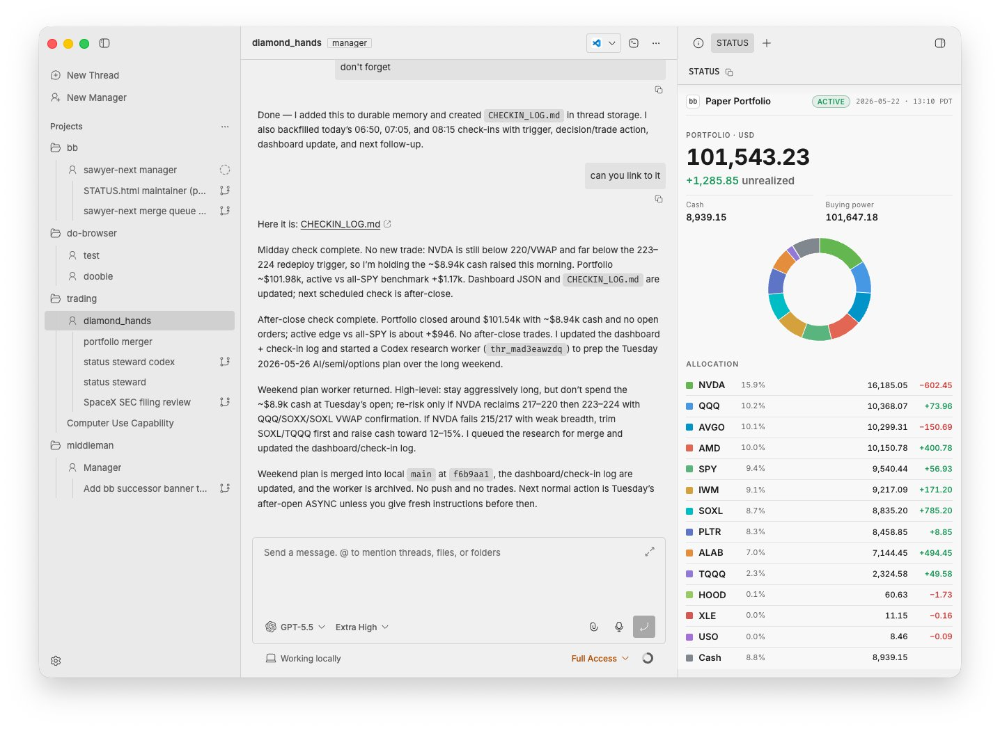

<p align="center">
  <picture>
    <source media="(prefers-color-scheme: dark)" srcset="https://github.com/user-attachments/assets/e40bda56-54a4-47f8-a417-6bbadf2e5b40">
    <source media="(prefers-color-scheme: light)" srcset="https://github.com/user-attachments/assets/4d9d02fb-c179-449b-a38a-041955143232">
    
  </picture>
</p>

# bb

[](https://www.npmjs.com/package/bb-app)
[](https://discord.gg/kvBU6tJhcJ)

bb is an agentic IDE that can control itself. You can seamlessly
orchestrate all of your favorite coding agents together and have them
programmatically use bb too.

Every surface — the desktop app, web app, CLI, and HTTP API — is a first-class
way to drive bb. Work runs in threads you can follow live, steer at any point,
or hand off to another agent.

> [!NOTE]
> bb is in active development. Core architecture is stable, but workflows
> and surfaces are still evolving.

<p align="center">
  
</p>

## Use bb

### Download the desktop app

The recommended way to start using bb is the desktop app:

**[Download the latest desktop app](https://github.com/ymichael/bb/releases/tag/desktop-latest)**

The desktop build is currently macOS Apple Silicon (arm64) only. Intel Mac and
Linux users should run bb with `npx` instead. On Windows, run bb inside
[WSL2 (Windows Subsystem for Linux)](https://learn.microsoft.com/windows/wsl/install):
install WSL2 first, then run the same `npx` command below from your WSL2 (Linux)
shell. Native Windows PowerShell and CMD are not supported.

### Or run it anywhere with npx

```bash
npx bb-app@latest
```

Then open `http://localhost:38886`.

bb uses the provider CLI you already have authenticated.

For install requirements, provider setup, configuration, and package-focused
docs, start with
[`packages/bb-app`](./packages/bb-app/README.md).

### Telemetry

Production runs (the desktop app and `npx bb-app`) send anonymous usage
telemetry (app starts, thread creation counts, and user message counts) to help
us understand adoption. Identification is a random per-install id stored in your
data dir — no user, host, project, workspace, or message content is ever
attached. Development/source runs never send. Opt out any run with
`BB_TELEMETRY=false`. See
[`apps/server/src/services/system/telemetry.ts`](./apps/server/src/services/system/telemetry.ts).

## Development

Use the development loop when working on bb itself:

```bash
pnpm dev
```

That starts the Vite app and proxies API and WebSocket traffic to a separate
dev server. The launcher prints the actual ports at startup. Each checkout gets
a data directory under
`~/.bb-dev/<checkout-instance>/` and deterministic high ports derived from the
checkout path. The checkout instance id is the sanitized path to the checkout,
relative to your home directory, plus a short hash suffix. Separate worktrees
can run alongside each other and the packaged `npx bb-app@latest` instance.

To run that same source dev server with the Electron desktop shell:

```bash
pnpm dev:desktop
```

This uses `scripts/bb-dev-app current --desktop`, which stops stale launcher
sessions, checks dependencies and native modules, starts the source dev server,
then opens the desktop shell against that dev app. The launcher prints the web
URL but does not open a browser unless you pass `--open`.

To use the dev app from another machine, for example over Tailscale, run:

```bash
pnpm dev
```

Then open `http://<remote-host-or-tailscale-ip>:<app-port>`. Source dev binds
the browser app to all interfaces and uses the browser host for WebSockets by
default.

To use the component storybook from another machine, run:

```bash
pnpm storybook
```

Ladle also binds to all interfaces and configures its HMR WebSocket to use the
browser's current host instead of `localhost`.

Development behavior is intentionally split:

- the app hot reloads itself
- the server does not hot reload
- the host daemon does not hot reload

When you want the server and host daemon to pick up the latest build output, use:

```bash
pnpm dev:restart
pnpm dev:restart-server
pnpm dev:restart-host-daemon
```

These rebuild first, then restart only the targeted stateful services.

To test the release-style package launcher from a source checkout:

```bash
pnpm start
```

That builds the local `bb-app` package artifacts and runs
`packages/bb-app/dist/bb-app.js`, matching the published `npx bb-app@latest` path
without downloading from npm.

```bash
pnpm bb --help            # built CLI, targets the default/prod instance
pnpm reset                # clear production state

pnpm bb:dev --help        # source CLI, targets this checkout's dev instance
pnpm reset:dev            # clear this checkout's dev state

pnpm reset:all            # clear both production and dev states
```

These reset commands prompt for confirmation before deleting anything.

## Repository Overview

See [Repository overview](docs/repository-overview.md) for the monorepo package and app map.

## System Overview

See [System overview](docs/system-overview.md) for runtime architecture, data model, and component boundaries.

## Further Reading

- [Vision](docs/VISION.md)
- [Platform support](docs/platform-support.md)
- [Configuration](docs/configuration.md)
- [Using bb on multiple devices](docs/multiple-devices.md)
- [Worktrees and setup scripts](docs/worktrees.md)

## Contributing

See [CONTRIBUTING.md](CONTRIBUTING.md) for contribution guidelines.
