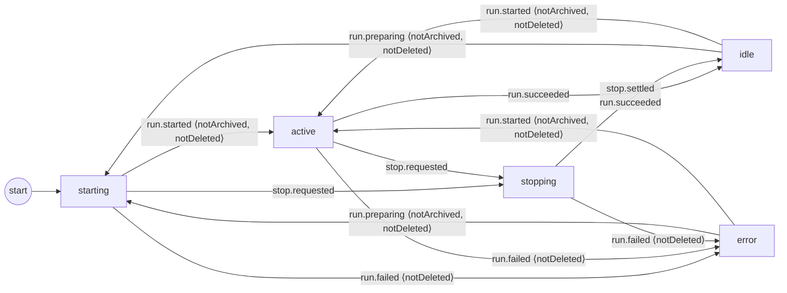
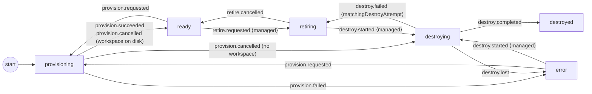

<!-- GENERATED FILE — do not edit by hand.
     Source: packages/domain/src/thread-lifecycle.ts and
     packages/domain/src/environment-lifecycle.ts.
     Regenerate: pnpm --filter @bb/domain exec vitest run test/lifecycle-diagram.test.ts -u -->

# Lifecycle state machines

Rendered from `THREAD_LIFECYCLE` and `ENVIRONMENT_LIFECYCLE` — the
transition tables consumed by the CAS single-writers in `@bb/db`
(`applyThreadLifecycleEvent` / `applyEnvironmentLifecycleEvent`).

How to read these: each edge groups all events that transition between
the same two statuses. An event label is
`event ⟨supersession predicates⟩`; the predicates are checked against
the loaded row inside the writer's transaction, and a failing predicate
makes the event a logged no-op.
An **absent** edge means the event is a no-op in that status (the
writer returns `illegal-transition`). Recovery and callback-ordering
policy should be handled before events reach these tables.

## Thread

## Environment

